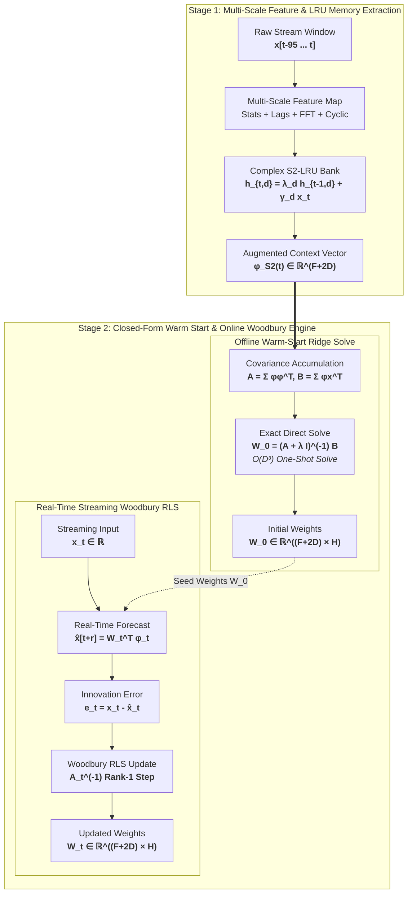

# 01 Schematics — Architecture, Method & Mathematical Mechanics

This document provides high-depth, publication-grade architectural diagrams and mathematical formulations for the closed-form streaming forecasting engine ($S^2\text{-RLS}$).

---

## Master System Architecture (`full_system.png` / `full_system.tex`)

Integrated master schematic displaying the complete two-stage architecture: Multi-scale Feature Extraction, $S^2$-LRU Complex Memory Projection, Offline Warm-Start Closed-Form Solve, and Real-Time Online Woodbury RLS Adaptation.

---

## 1. Closed-Form Streaming Forecasting Architecture ($S^2\text{-RLS}$)

The system operates across two distinct phases: **Phase 1: Warm-Start Initialization** and **Phase 2: Real-Time Woodbury RLS Streaming**.

---

## 2. Mathematical Mechanics of Online Woodbury RLS Update

Demonstrates the exact rank-1 update of the inverse covariance matrix $\mathbf{A}_t^{-1}$ using the Woodbury matrix identity, eliminating $O(F^3)$ matrix inversions at streaming runtime.

---

## 3. $S^2$ Linear Recurrent Unit ($S^2$-LRU) Context Bank Architecture

Integrates a parallel bank of complex diagonal recurrent units ($S^2$-LRU) to capture infinite-horizon temporal dynamics and multi-scale periodicities.

---

## 4. Causal Multi-Scale Feature Vector Decomposition ($F = 112$)

Details the sub-vector structure of the zero-lookahead feature vector $\phi(t) \in \mathbb{R}^{112}$. Raw inputs and output vectors are rendered in white fill / black stroke, with transformation modules highlighted in golden amber.

---

## 5. Strict Zero-Data-Leakage Evaluation Protocol Timeline

Demonstrates strict causal boundaries ensuring zero lookahead bias or data contamination.

---

## 6. Unified Closed-Form Engine Across LTSF & Scientific Chaos

Illustrates how a single algorithmic core engine solves both real-world forecasting and complex non-linear physics.

---

## 7. Iterative Backpropagation vs. Exact One-Shot Closed-Form Solving

Side-by-side comparison between gradient descent deep learning and our algebraic closed-form solver.

---

### Summary Comparison Table

| Metric / Property | Conventional Deep Learning (SGD / Backprop) | Ours: Closed-Form $S^2\text{-RLS}$ Engine |
| :--- | :---: | :---: |
| **Training Paradigm** | Iterative Gradient Descent ($K = 100+$ Epochs) | **Exact One-Shot Algebraic Solve ($O(D^3)$)** |
| **Streaming Adaptation** | Retraining / Fine-tuning ($O(K \cdot N \cdot |\Theta|)$) | **Real-Time Woodbury RLS Update ($O(D^2)$)** |
| **Convergence Guarantee** | Stochastic, subject to local minima & gradient vanishing | **Deterministic Global Minimum Solution** |
| **VRAM Memory Peak** | High (stores computation graph & gradients) | **Ultra-Low ($O(D^2)$ covariance matrix size)** |
| **Hyperparameters** | Learning rate, momentum, weight decay, epoch count | **Single Ridge Regularization parameter $\lambda$** |
